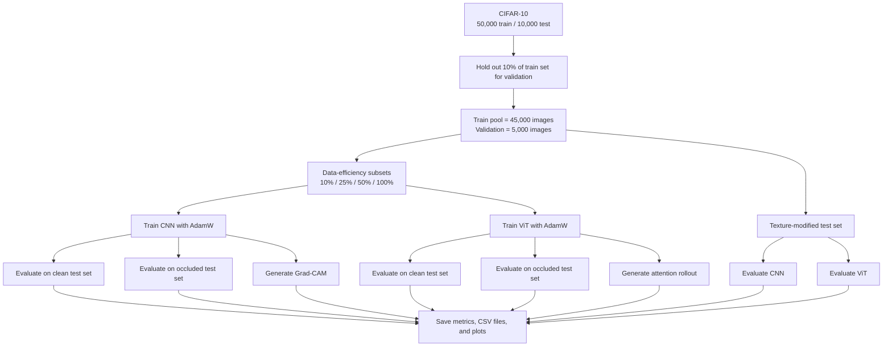

# Transfer Learning and Interpretable AI: Understanding CNN vs Vision Transformer

Research-oriented PyTorch project for comparing Convolutional Neural Networks (CNNs) and Vision Transformers (ViTs) on CIFAR-10 with a focus on:

- texture vs. shape bias
- robustness to occlusion
- data efficiency
- interpretability through Grad-CAM and attention visualization

The implementation is intentionally lightweight so it can run on a single GPU or CPU, while still following a modular setup.

## Research Goal

The project studies not only which model is more accurate, but also how each model behaves under controlled shifts and limited data:

- Does the model rely more on local texture cues or on larger global structure?
- How much performance drops when part of the image is hidden?
- How much labeled data is needed before the model learns effectively?
- What regions or token interactions drive the final prediction?

In practice, this means we train both architectures under the same protocol and compare them across clean accuracy, robustness, data efficiency, and interpretability.

The repository now supports three connected stages:

1. Source-stage pretraining and controlled analysis on CIFAR-10.
2. Downstream transfer to EuroSAT using either random initialization or the saved CIFAR checkpoints.
3. Downstream transfer to the Brain Tumor MRI dataset using the same scratch-vs-pretrained comparison.

## Current Results

These are the currently saved results in `outputs/`.

### CIFAR-10 source study

| Model | Clean accuracy | Occluded accuracy | Texture accuracy |
| --- | ---: | ---: | ---: |
| CNN | `85.70%` | `80.32%` | `32.98%` |
| ViT | `73.36%` | `68.81%` | `50.26%` |

- CNN is clearly stronger on standard CIFAR-10 accuracy and data efficiency.
- ViT is much more robust to the texture-modified test set.

### EuroSAT transfer

| Model | Scratch | CIFAR-pretrained |
| --- | ---: | ---: |
| CNN | `96.52%` | `96.74%` |
| ViT | `93.59%` | `94.15%` |

- Transfer helps both models, but the gain on EuroSAT is small.
- CNN remains stronger than ViT on this downstream task.

### Brain Tumor MRI transfer

| Model | Scratch | CIFAR-pretrained |
| --- | ---: | ---: |
| CNN | `82.56%` | `89.38%` |
| ViT | `85.88%` | `93.00%` |

- Transfer helps both models substantially on Brain Tumor MRI.
- On this medical-image task, the pretrained ViT is the strongest result in the repository so far.

## Pipeline Overview



## Experimental Setup

### 1. Input data

| Item | Value |
| --- | --- |
| Dataset | CIFAR-10 |
| Number of classes | `10` |
| Native image size | `32 x 32 x 3` |
| Color format | RGB |
| Resize step | None |

The project keeps CIFAR-10 at its native resolution. Images are not downscaled below `32 x 32`, and they are not resized to a larger training resolution either.

### 2. Preprocessing and transforms

The training and evaluation pipelines are intentionally different. Here, `ToTensor()` and `Normalize(...)` are preprocessing transforms. The random crop, flip, rotation, and affine steps are augmentation transforms.

| Split | Transform sequence | Purpose |
| --- | --- | --- |
| Train | `RandomCrop(32, padding=4)` -> `RandomHorizontalFlip()` -> `ToTensor()` -> `Normalize(mean, std)` | Add light augmentation while keeping the task realistic |
| Validation | `ToTensor()` -> `Normalize(mean, std)` | Deterministic validation |
| Test | `ToTensor()` -> `Normalize(mean, std)` | Deterministic testing |

Normalization uses the CIFAR-10 channel statistics:

- Mean: `(0.4914, 0.4822, 0.4465)`
- Std: `(0.2470, 0.2435, 0.2616)`

Important design choice:

- Augmentation is applied only to the training split.
- Validation and test images are kept deterministic so CNN and ViT are compared on the same reference distribution.

### 3. Dataset splits

| Split | Size | Notes |
| --- | ---: | --- |
| Original training set | `50,000` | Standard CIFAR-10 training split |
| Validation set | `5,000` | `10%` of the original training set |
| Remaining training pool | `45,000` | Used for data-efficiency experiments |
| Clean test set | `10,000` | Standard CIFAR-10 test split |
| Occluded test set | `10,000` | Clean test images with square masking |
| Texture-modified test set | `10,000` | Clean test images with patch shuffling and noise |

The validation split is created once with a fixed random seed and reused across all experiments. This keeps the comparison controlled.

### 4. Data-efficiency design

The data-efficiency experiment changes only the size of the training subset. The validation set and test set do not change.

| Train fraction | Training images used | Meaning |
| --- | ---: | --- |
| `10%` | `4,500` | Very low-data regime |
| `25%` | `11,250` | Low-data regime |
| `50%` | `22,500` | Medium-data regime |
| `100%` | `45,000` | Full-data reference |

This is not continuous training. Each fraction is a separate run trained from scratch.

For each architecture, the project performs:

- 1 run at `10%`
- 1 run at `25%`
- 1 run at `50%`
- 1 run at `100%`

That means:

- `4` independent CNN runs
- `4` independent ViT runs
- `8` independent training runs in total

The purpose is to measure how quickly each architecture benefits from additional labeled data.

### 5. Robustness design

Both models are always trained on clean CIFAR-10. The robustness experiment modifies only the test distribution.

| Test condition | Description | Goal |
| --- | --- | --- |
| Clean | Standard CIFAR-10 test set | Baseline accuracy |
| Occluded | Random square region is masked | Test robustness to missing local evidence |
| Texture-modified | Local patches are shuffled and mild noise is added | Test sensitivity to texture disruption |

Only the full-data models from the `100%` training runs are reused for the robustness evaluation.

### 6. Interpretability design

| Model | Method | What it shows |
| --- | --- | --- |
| CNN | Grad-CAM | Which spatial image regions most influenced the prediction |
| ViT | Attention rollout | How information flows from image patches toward the class token |

Interpretability is also generated from the full-data models so the visualizations reflect the strongest trained version of each architecture.

### 7. Model and optimization settings

| Component | Setting |
| --- | --- |
| CNN | 3 convolutional stages with batch normalization, ReLU, pooling, dropout, and a classifier head |
| ViT | Patch embedding, learnable class token, positional embeddings, transformer encoder blocks, classifier head |
| Optimizer | AdamW |
| Learning rate | `1e-3` |
| Weight decay | `1e-4` |
| Batch size | `128` by default |
| Epochs | `5` by default, `20` with `--full` |
| Random seed | `42` |

## What The Pipeline Measures

| Question | Measurement |
| --- | --- |
| Which model is more accurate on standard classification? | Clean test accuracy |
| Which model is more robust to partial information loss? | Accuracy drop on occluded test images |
| Which model is more sensitive to texture corruption? | Accuracy drop on texture-modified test images |
| Which model learns better from small datasets? | Accuracy as training fraction grows from `10%` to `100%` |
| What drives the prediction? | Grad-CAM for CNN, attention rollout for ViT |

## EuroSAT Transfer Setup

The first downstream transfer stage uses EuroSAT as an out-of-distribution image-classification benchmark.

### 1. Downstream dataset design

| Item | Value |
| --- | --- |
| Dataset | EuroSAT RGB |
| Number of classes | `10` |
| Working image size | `64 x 64 x 3` |
| Split strategy | Stratified random split with fixed seed |
| Default split | `80%` train, `10%` validation, `10%` test |

The EuroSAT pipeline uses a stratified split so every class stays represented across train, validation, and test.

### 2. EuroSAT transforms

| Split | Transform sequence |
| --- | --- |
| Train | `Resize(64, 64)` -> `RandomHorizontalFlip()` -> `RandomVerticalFlip()` -> `ToTensor()` -> `Normalize(mean, std)` |
| Validation | `Resize(64, 64)` -> `ToTensor()` -> `Normalize(mean, std)` |
| Test | `Resize(64, 64)` -> `ToTensor()` -> `Normalize(mean, std)` |

In this stage, `Resize`, `ToTensor`, and `Normalize` are preprocessing. The horizontal and vertical flips are augmentation.

The EuroSAT normalization defaults are standard RGB values:

- Mean: `(0.485, 0.456, 0.406)`
- Std: `(0.229, 0.224, 0.225)`

### 3. EuroSAT comparison matrix

For each architecture, the transfer runner compares:

- `scratch`: train directly on EuroSAT from random initialization
- `pretrained`: load the CIFAR-10 backbone checkpoint, keep a new EuroSAT classifier head, and fine-tune end to end

So the EuroSAT transfer stage runs:

- CNN scratch
- CNN pretrained on CIFAR-10 then fine-tuned on EuroSAT
- ViT scratch
- ViT pretrained on CIFAR-10 then fine-tuned on EuroSAT

### 4. Fine-tuning details

| Setting | Value |
| --- | --- |
| Optimizer | AdamW |
| Scratch learning rate | `1e-3` |
| Pretrained backbone learning rate | `1e-4` |
| Pretrained classifier-head learning rate | `1e-3` |
| Weight decay | `1e-4` |
| Epochs | `10` by default, `25` with `--full` |

For the ViT transfer runs, the positional embeddings are automatically interpolated when moving from CIFAR-10 resolution to EuroSAT resolution.

## Brain MRI Transfer Setup

The second downstream transfer stage uses the Kaggle Brain Tumor MRI dataset as a medical-image classification benchmark.

### 1. Expected local dataset layout

This dataset is not auto-downloaded by the project. Download it manually from Kaggle and place it under a directory that contains:

```text
data/brain_tumor_mri_dataset/
├── Training/
│   ├── glioma/
│   ├── meningioma/
│   ├── notumor/
│   └── pituitary/
└── Testing/
    ├── glioma/
    ├── meningioma/
    ├── notumor/
    └── pituitary/
```

If your extracted folder has one extra wrapper directory, the loader will detect that automatically.

### 2. Brain MRI setup

| Item | Value |
| --- | --- |
| Dataset | Brain Tumor MRI |
| Number of classes | `4` |
| Working image size | `128 x 128 x 3` |
| Split strategy | Provided Kaggle `Training/` and `Testing/` folders, plus a validation split carved from `Training/` |
| Default validation split | `15%` of the training folder |

### 3. Brain MRI transforms

| Split | Transform sequence |
| --- | --- |
| Train | `RGB convert` -> `Resize(128, 128)` -> `RandomRotation(10)` -> `RandomAffine(translate/scale)` -> `ToTensor()` -> `Normalize(mean, std)` |
| Validation | `RGB convert` -> `Resize(128, 128)` -> `ToTensor()` -> `Normalize(mean, std)` |
| Test | `RGB convert` -> `Resize(128, 128)` -> `ToTensor()` -> `Normalize(mean, std)` |

In this stage, `RGB convert`, `Resize`, `ToTensor`, and `Normalize` are preprocessing. `RandomRotation` and `RandomAffine` are augmentation. The medical pipeline uses light geometry-only augmentation and avoids the stronger orientation changes used in EuroSAT.

### 4. Brain MRI comparison matrix

For each architecture, the runner compares:

- `scratch`: train directly on Brain MRI from random initialization
- `pretrained`: load the CIFAR-10 backbone checkpoint, replace the classifier head, and fine-tune end to end

### 5. Run commands

```bash
uv run python main.py --experiment brain_mri --brain-mri-data-dir data/brain_tumor_mri_dataset
uv run python main.py --experiment brain_mri --transfer-mode pretrained --brain-mri-data-dir data/brain_tumor_mri_dataset
uv run python main.py --experiment brain_mri --models cnn --brain-mri-data-dir data/brain_tumor_mri_dataset
uv run python main.py --experiment brain_mri --brain-mri-train-fraction 0.25 --brain-mri-data-dir data/brain_tumor_mri_dataset
```

Brain MRI artifacts are saved to `outputs/brain_mri_transfer/`.

## Project Structure

```text
project/
├── configs/
│   └── config.py
├── datasets/
│   ├── brain_mri_loader.py
│   ├── cifar_loader.py
│   ├── eurosat_loader.py
│   ├── occlusion.py
│   └── texture_modification.py
├── evaluation/
│   ├── metrics.py
│   └── robustness.py
├── experiments/
│   ├── run_brain_mri_transfer.py
│   ├── run_eurosat_transfer.py
│   └── run_experiments.py
├── interpretability/
│   ├── gradcam.py
│   └── vit_attention.py
├── models/
│   ├── cnn.py
│   └── vit.py
├── training/
│   └── trainer.py
├── utils/
│   ├── helpers.py
│   └── transfer.py
├── main.py
├── pyproject.toml
├── uv.lock
└── README.md
```

## Features

- CIFAR-10 with train / validation / test split
- Standard preprocessing: normalization, random crop, horizontal flip
- Controlled evaluation shifts:
  - square occlusion masking
  - texture distortion via local patch shuffling and mild noise
- Two lightweight models:
  - batch-normalized CNN
  - custom ViT with patch embeddings, class token, and transformer encoder blocks
- AdamW training pipeline with loss / accuracy tracking
- Experiments for:
  - baseline accuracy
  - occlusion robustness
  - texture bias
  - data efficiency at 10%, 25%, 50%, 100%
- EuroSAT transfer-learning experiments:
  - scratch training
  - CIFAR-pretrained fine-tuning
- Interpretability outputs:
  - Grad-CAM for the CNN
  - attention rollout for the ViT

## Dependency Management

This project uses `uv` instead of `pip` or `requirements.txt`.

```bash
uv sync
uv run python main.py --experiment cifar
```

PyTorch is pinned to a CUDA 12.8-compatible stack for Linux and Windows:

- `torch==2.9.1`
- `torchvision==0.24.1`
- Linux/Windows GPU installs use the official PyTorch `cu128` index
- macOS falls back to the default CPU wheels

For a longer research-style run:

```bash
uv run python main.py --experiment cifar --full
```

To run the downstream EuroSAT stage after CIFAR checkpoints have been created:

```bash
uv run python main.py --experiment eurosat
```

Useful EuroSAT options:

```bash
uv run python main.py --experiment eurosat --transfer-mode pretrained
uv run python main.py --experiment eurosat --checkpoint-dir outputs/checkpoints
uv run python main.py --experiment eurosat --cnn-checkpoint /path/to/cnn_100pct_best.pt --vit-checkpoint /path/to/vit_100pct_best.pt
uv run python main.py --experiment eurosat --models cnn
uv run python main.py --experiment eurosat --eurosat-train-fraction 0.25
```

The default CIFAR run is a lightweight protocol with 5 epochs per experiment for quick iteration. The `--full` flag switches CIFAR to 20 epochs and EuroSAT to 25 epochs.

If you want to run only one architecture, use `--models`:

```bash
uv run python main.py --experiment cifar --models cnn
uv run python main.py --experiment cifar --models vit
uv run python main.py --experiment eurosat --models cnn
uv run python main.py --experiment eurosat --models vit
```

To regenerate plots later from saved artifacts without retraining:

```bash
uv run python experiments/regenerate_plots.py --experiment cifar --source-dir outputs
uv run python experiments/regenerate_plots.py --experiment eurosat --source-dir outputs/eurosat_transfer
```

This is useful when you want to change labels, update styles, or rebuild figures on another machine after copying back the saved outputs and checkpoints.

To evaluate pulled checkpoints directly and generate confusion matrices plus interpretability figures without retraining:

```bash
uv run python experiments/evaluate_checkpoints.py --checkpoint-dir outputs/checkpoints
uv run python experiments/evaluate_checkpoints.py --checkpoint-paths outputs/checkpoints/cnn_100pct_best.pt outputs/checkpoints/vit_100pct_best.pt
```

This checkpoint-only workflow saves per-checkpoint summaries, classification reports, confusion matrices, and Grad-CAM or ViT attention figures into `outputs/checkpoint_evaluation/`.
It also saves normalized confusion matrices, class-wise prediction analysis, and grids of correct and misclassified examples so you can inspect behavior from pulled weights before deciding whether retraining is necessary.

## CLI Execution Flow

When you run `uv run python main.py`, the project executes the following stages:

1. Load the project configuration and apply any command-line overrides.
2. Set the random seed for reproducibility.
3. Detect whether the run will use CPU, CUDA, or MPS.
4. Print the runtime diagnostics and planned dataset protocol.
5. Train the CNN on each training fraction: `10%`, `25%`, `50%`, `100%`.
6. Train the ViT on the same training fractions.
7. Keep the full-data runs for downstream robustness and interpretability analysis.
8. Evaluate the full-data CNN and ViT on:
   - the clean test set
   - the occluded test set
   - the texture-modified test set
9. Generate Grad-CAM for the CNN and attention maps for the ViT.
10. Save summaries, CSV files, plots, and interpretability figures to `outputs/`.

When you run `uv run python main.py --experiment eurosat`, the project executes the following stages:

1. Load EuroSAT with a stratified train / validation / test split.
2. Build one CNN and one ViT for EuroSAT resolution.
3. Run the requested initialization modes:
   - scratch
   - pretrained from CIFAR checkpoints
4. For pretrained runs, load only the transferable backbone weights and keep a fresh EuroSAT classifier head.
5. Fine-tune on the EuroSAT training split and select the best validation checkpoint in memory.
6. Save EuroSAT checkpoints, plots, CSV summaries, and `summary.json` into `outputs/eurosat_transfer/`.

The EuroSAT summary rows also include `macro_f1` and `weighted_f1`, so the downstream stage is not limited to accuracy alone.

## Why The Train Split Grows From 10% To 100%

The increasing training split is the core of the data-efficiency experiment.

- `10%` asks: can the architecture learn well from very little data?
- `25%` and `50%` show how performance improves as more supervision becomes available.
- `100%` provides the full-data reference point.

If a model performs strongly even at `10%`, it is more data-efficient. If it needs much more data before it becomes competitive, it is less data-efficient. The changing split is therefore intentional and central to the research question.

## Outputs

Running the CIFAR source-stage experiment writes artifacts to `outputs/`:

- `summary.json`: experiment summary
- `data_efficiency_runs.json`: detailed per-run metadata with saved training histories
- `data_efficiency.csv`: accuracy across data fractions
- `robustness.csv`: robustness drops for occlusion and texture shifts
- `checkpoints/`: saved best-model checkpoints for each architecture and training fraction
- `plots/`: per-model training curves, a combined CNN-vs-ViT learning-curve figure, per-model data-fraction learning-curve figures, data-efficiency plots, and robustness plots
- `interpretability/`: Grad-CAM and ViT attention visualizations

Checkpoint filenames follow the pattern:

- `outputs/checkpoints/cnn_10pct_best.pt`
- `outputs/checkpoints/cnn_100pct_best.pt`
- `outputs/checkpoints/vit_50pct_best.pt`

Each checkpoint stores the model `state_dict` together with basic metadata such as the model name, training fraction, class names, configuration, and validation/test accuracy.
Newer checkpoints also store the per-epoch training history so plots can be regenerated later without retraining.

Running the EuroSAT transfer stage writes artifacts to `outputs/eurosat_transfer/`:

- `summary.json`: transfer summary and split metadata
- `transfer_runs.json`: detailed scratch / pretrained runs with saved histories
- `eurosat_transfer_results.csv`: scratch vs pretrained transfer results
- `checkpoints/`: saved best EuroSAT models for each run
- `plots/eurosat_transfer_accuracy.png`: final test-accuracy comparison
- `plots/eurosat_transfer_validation_curves.png`: validation learning curves across transfer runs

## Notes

- CIFAR-10 is downloaded automatically the first time you run the project.
- EuroSAT is also downloaded automatically the first time you run the transfer stage.
- CPU runs are supported, but GPU is recommended for the full experiment schedule.
- Checkpoints are saved in `outputs/checkpoints/` in a portable CPU-friendly format so they can be loaded later on another machine with `torch.load(..., map_location="cpu")`.
- EuroSAT fine-tuning also saves downstream checkpoints in `outputs/eurosat_transfer/checkpoints/`.
- The repo keeps both checkpoint folders trackable: `outputs/checkpoints/` and `outputs/eurosat_transfer/checkpoints/`. Other generated output folders remain ignored. If you plan to version many checkpoints, Git LFS is recommended.
- `timm` is included as a dependency so the project can be extended with pretrained reference models later without changing the environment setup.
