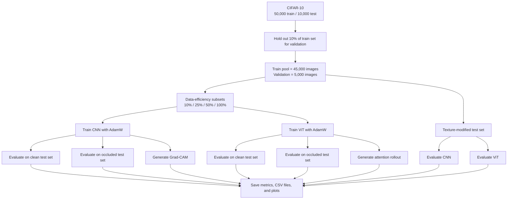

# Understanding CNN vs Vision Transformer

Research-oriented PyTorch project for comparing Convolutional Neural Networks (CNNs) and Vision Transformers (ViTs) on CIFAR-10 with a focus on:

- texture vs. shape bias
- robustness to occlusion
- data efficiency
- interpretability through Grad-CAM and attention visualization

The implementation is intentionally lightweight so it can run on a single GPU or CPU, while still following a modular setup.

## Research Goal

The project studies not only which model is more accurate, but also how each model behaves under controlled shifts and limited data:

- Does the model rely more on local texture cues or on larger global structure?
- How much performance drops when part of the image is hidden?
- How much labeled data is needed before the model learns effectively?
- What regions or token interactions drive the final prediction?

In practice, this means we train both architectures under the same protocol and compare them across clean accuracy, robustness, data efficiency, and interpretability.

## Pipeline Overview



## Experimental Setup

### Dataset protocol

- Source dataset: CIFAR-10
- Original training split: `50,000` images
- Original test split: `10,000` images
- Validation fraction: `10%` of the original training set
- Validation set size: `5,000` images
- Remaining training pool after validation split: `45,000` images
- Clean test size: `10,000` images
- Occluded test size: `10,000` images
- Texture-modified test size: `10,000` images

### Data-efficiency protocol

The data-efficiency experiment does not change the validation or test sets. It changes only how much of the `45,000`-image training pool is used for fitting the model.

| Train fraction | Training images used | Purpose |
| --- | ---: | --- |
| `10%` | `4,500` | Stress-test learning under very limited supervision |
| `25%` | `11,250` | Observe early scaling behavior |
| `50%` | `22,500` | Measure mid-budget performance |
| `100%` | `45,000` | Reference full-data run |

This setup makes the comparison fair: CNN and ViT always see the same validation set and the same test set, while only the training budget changes.

### Distribution-shift protocol

Both models are always trained on clean CIFAR-10. Robustness is measured by changing only the test distribution:

- Occlusion shift: randomly masks a square patch in the image
- Texture shift: shuffles local patches and adds mild noise while preserving the overall object layout

This isolates generalization behavior from training-time corruption.

### Interpretability protocol

- CNN interpretability: Grad-CAM highlights which spatial regions most influenced the prediction
- ViT interpretability: attention rollout visualizes how information flows from image patches toward the class token

## What The Pipeline Measures

| Question | Measurement |
| --- | --- |
| Which model is more accurate on standard classification? | Clean test accuracy |
| Which model is more robust to partial information loss? | Accuracy drop on occluded test images |
| Which model is more sensitive to texture corruption? | Accuracy drop on texture-modified test images |
| Which model learns better from small datasets? | Accuracy as training fraction grows from `10%` to `100%` |
| What drives the prediction? | Grad-CAM for CNN, attention rollout for ViT |

## Project Structure

```text
project/
├── configs/
│   └── config.py
├── datasets/
│   ├── cifar_loader.py
│   ├── occlusion.py
│   └── texture_modification.py
├── evaluation/
│   ├── metrics.py
│   └── robustness.py
├── experiments/
│   └── run_experiments.py
├── interpretability/
│   ├── gradcam.py
│   └── vit_attention.py
├── models/
│   ├── cnn.py
│   └── vit.py
├── training/
│   └── trainer.py
├── utils/
│   └── helpers.py
├── main.py
├── pyproject.toml
├── uv.lock
└── README.md
```

## Features

- CIFAR-10 with train / validation / test split
- Standard preprocessing: normalization, random crop, horizontal flip
- Controlled evaluation shifts:
  - square occlusion masking
  - texture distortion via local patch shuffling and mild noise
- Two lightweight models:
  - batch-normalized CNN
  - custom ViT with patch embeddings, class token, and transformer encoder blocks
- AdamW training pipeline with loss / accuracy tracking
- Experiments for:
  - baseline accuracy
  - occlusion robustness
  - texture bias
  - data efficiency at 10%, 25%, 50%, 100%
- Interpretability outputs:
  - Grad-CAM for the CNN
  - attention rollout for the ViT

## Dependency Management

This project uses `uv` instead of `pip` or `requirements.txt`.

```bash
uv sync
uv run python main.py
```

For a longer research-style run:

```bash
uv run python main.py --full
```

The default run is a lightweight protocol with 5 epochs per experiment for quick iteration. The `--full` flag switches to 20 epochs.

## CLI Execution Flow

When you run `uv run python main.py`, the project executes the following stages:

1. Load the project configuration and apply any command-line overrides.
2. Set the random seed for reproducibility.
3. Detect whether the run will use CPU, CUDA, or MPS.
4. Print the runtime diagnostics and planned dataset protocol.
5. Train the CNN on each training fraction: `10%`, `25%`, `50%`, `100%`.
6. Train the ViT on the same training fractions.
7. Keep the full-data runs for downstream robustness and interpretability analysis.
8. Evaluate the full-data CNN and ViT on:
   - the clean test set
   - the occluded test set
   - the texture-modified test set
9. Generate Grad-CAM for the CNN and attention maps for the ViT.
10. Save summaries, CSV files, plots, and interpretability figures to `outputs/`.

## Why The Train Split Grows From 10% To 100%

The increasing training split is the core of the data-efficiency experiment.

- `10%` asks: can the architecture learn well from very little data?
- `25%` and `50%` show how performance improves as more supervision becomes available.
- `100%` provides the full-data reference point.

If a model performs strongly even at `10%`, it is more data-efficient. If it needs much more data before it becomes competitive, it is less data-efficient. The changing split is therefore intentional and central to the research question.

## Outputs

Running the project writes artifacts to `outputs/`:

- `summary.json`: experiment summary
- `data_efficiency.csv`: accuracy across data fractions
- `robustness.csv`: robustness drops for occlusion and texture shifts
- `plots/`: per-model training curves, a combined CNN-vs-ViT learning-curve figure, data-efficiency plots, and robustness plots
- `interpretability/`: Grad-CAM and ViT attention visualizations

## Notes

- CIFAR-10 is downloaded automatically the first time you run the project.
- CPU runs are supported, but GPU is recommended for the full experiment schedule.
- `timm` is included as a dependency so the project can be extended with pretrained reference models later without changing the environment setup.
